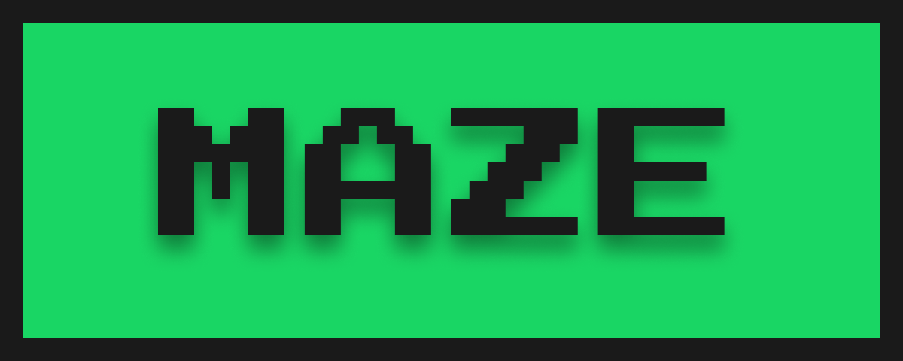

<h1 align="center">
  
</h1>

  <a href="#computer-projeto">Projeto</a>&nbsp;&nbsp;&nbsp;|&nbsp;&nbsp;&nbsp;
  <a href="#memo-licença">Licença</a>

  
  

## :computer: Projeto

O **MAZE** é um projeto desenvolvido em C++ que visa aplicar os conceitos
aprendidos durante as aulas do 2º semestre em Técnicas de Programação.

### Features

Nesse projeto foram utilizados alguns recursos da linguagem como:

- Structs
- Recursividade
- Funções

### :construction_worker: Time

- [21382532] Guilherme H. da Silva Oliveira
- [21433930] Luiz Daniel Oliveira dos Santos
- [21470440] Matheus de Carvalho Reges
- [21470350] Rômulo Sousa B. de Melo

### :mortar_board: Orientador

Este projeto foi orientado pelo professor [André Luiz Maciel Santana](https://www.linkedin.com/in/andrelms91/).

## :memo: Licença

Esse projeto está sob a licença MIT.
Veja o arquivo [LICENSE](LICENSE) para mais detalhes.

---
